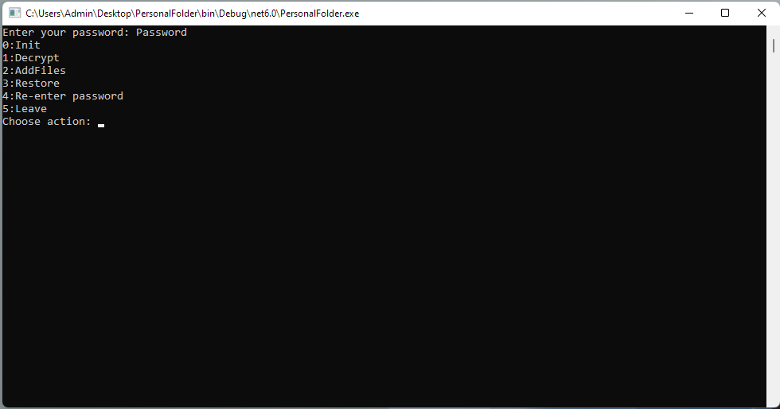

# Personal Folder
	Приложение, обеспечивающее посредством алгоритма AES шифрование файлов и их имен, а также обратный процесс, называемый дешифрованием.
	Введенный пароль для проверки подлинности хранится в виде хэша SHA256 в файле. Не исключена возможность перебора пароля таким образом, поэтому длина и символы должны составлять стойкий пароль, пример такого пароля: DFn29@!dfs043jr2%%
	Функции:
	- Шифрование файлов в директории
	- Добавление файлов и их шифрование
	- Расшифровка всех зашифрованных файлов
	- Проверка подлинности пароля
	- Безопасное удаление файлов после шифрования

Перечень использованных технологий:
- .NET 6
- Colorful Console
- System AES encryption
- Windows SDelete

CUI

@R_Rezak_K
